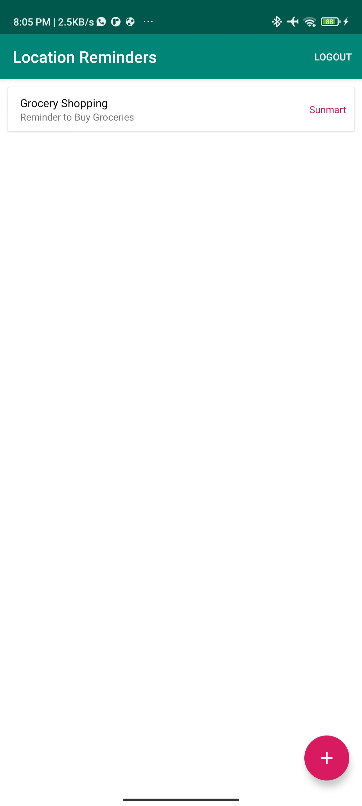
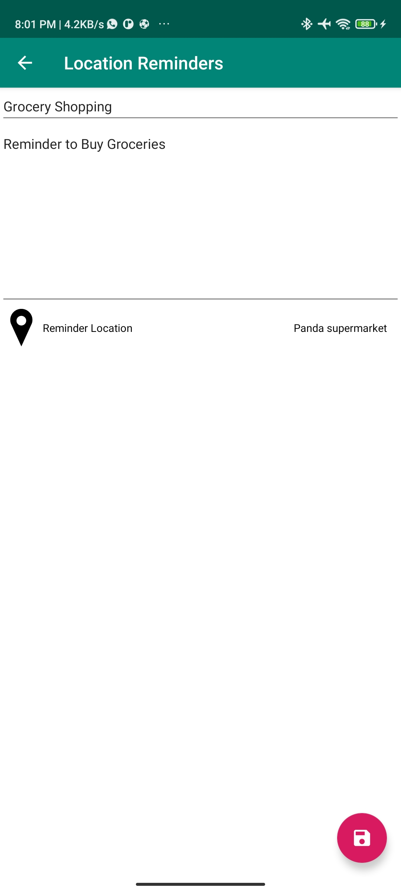
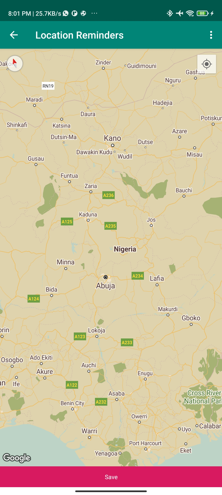

# Location Reminder
Location Reminder is a TO-DO list app with location reminders that remind the user to do something when the user is at a specific location. The app will require the user to create an account and login to set and access reminders.
This  is a project for the Udacity Android kotlin Nanodegree Program.

## Features
- MVVM Architecture
- Google Maps API
- Geofencing API
- UI and Unit Testing
- Firebase Authentication

## Libraries
- RecyclerView
- Navigation Component
- ViewModel
- LiveData
- Room
- Databinding
- Coroutines
- Material Design Component
- Firebase Auth
- Mockito

## Prerequisite
To build this project, you require:
- Android Studio artic fox
- Gradle 7.0.4

## Screenshots
<h4 align="center">

## Author
Babatunde OWoleke

## License
This project is licensed under the Apache License 2.0 - See: http://www.apache.org/licenses/LICENSE-2.0.txt

